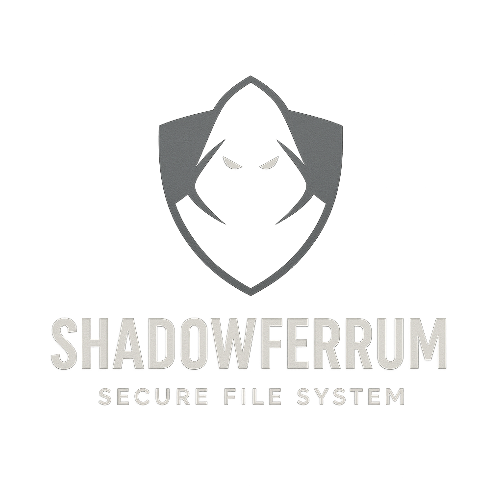

# ShadowFerrum

<div align="center">
  


**A Secure, Self-Contained FUSE-Backed File Server in Rust**

[](https://www.rust-lang.org/)
[](https://github.com/yourusername/shadowferrum)
[](https://oauth.net/2/)
[](LICENSE)

</div>

## 🛡️ Overview

ShadowFerrum is a secure, internet-facing file server system built entirely within the Rust ecosystem. It provides a complete solution for remote file storage with transparent local filesystem mounting via FUSE, secured by OAuth 2.0 authentication and TLS encryption.

The system eliminates dependencies on external applications or services, providing a truly self-contained solution that leverages Rust's memory safety guarantees to create a robust and secure file storage platform.

## ✨ Key Features

### Security First
- 🔐 **OAuth 2.0 Authorization Server** - Built-in authentication with Authorization Code flow + PKCE
- 🔑 **JWT-based Access Control** - Cryptographically signed tokens for API authorization
- 🛡️ **TLS/HTTPS Only** - All communications encrypted using rustls
- 🔒 **Argon2 Password Hashing** - Industry-leading password security
- 🚫 **Memory Safe** - Zero unsafe code in core components

### Technical Excellence
- ⚡ **Async/Await Architecture** - High-performance concurrent operations using Tokio
- 📁 **FUSE Filesystem Client** - Transparent mounting as local volume
- 🔄 **Token Refresh** - Automatic token renewal without re-authentication
- 📊 **RESTful API** - Clean, resource-oriented endpoints
- 🏗️ **Modular Design** - Clear separation between Auth Server and Resource Server

## 🏗️ Architecture

```
┌─────────────────────────────────────────────────────────────────┐
│                         ShadowFerrum System                      │
├───────────────────────────────┬─────────────────────────────────┤
│          SERVER               │            CLIENT                │
├───────────────────────────────┼─────────────────────────────────┤
│                               │                                  │
│  ┌──────────────────────┐     │     ┌─────────────────────┐     │
│  │  Authorization Server │     │     │    FUSE Client      │     │
│  │  - User Auth         │     │     │  - Mount FS         │     │
│  │  - OAuth 2.0         │◄────┼────►│  - Translate Ops    │     │
│  │  - JWT Issuance      │     │     │  - Token Storage    │     │
│  └──────────────────────┘     │     └─────────────────────┘     │
│                               │                                  │
│  ┌──────────────────────┐     │     ┌─────────────────────┐     │
│  │   Resource Server    │     │     │   OS Filesystem     │     │
│  │  - File API          │◄────┼────►│   Interface         │     │
│  │  - CRUD Operations   │     │     │  - Read/Write       │     │
│  │  - Token Validation  │     │     │  - Directory Ops    │     │
│  └──────────────────────┘     │     └─────────────────────┘     │
│                               │                                  │
└───────────────────────────────┴─────────────────────────────────┘
                                ▲
                                │ HTTPS + OAuth 2.0
                                ▼
```

## 🚀 Quick Start

### Prerequisites
- Rust 1.70+ with Cargo
- Operating system with FUSE support (Linux, macOS, Windows with WinFsp)

### Building the Project

```bash
# Clone the repository
git clone https://github.com/yourusername/shadowferrum.git
cd shadowferrum

# Build the server
cargo build --release --bin server

# Build the client (when implemented)
cargo build --release --bin client
```

### Running the Server

```bash
# Set environment variables (optional)
export DATA_ROOT="./data"
export JWT_SECRET="your-secure-secret-key"

# Run the server
cargo run --bin server

# Server will start on https://127.0.0.1:3000
```

### Testing OAuth Flow

The server includes built-in OAuth 2.0 endpoints:
- `/oauth/authorize` - Authorization endpoint
- `/oauth/token` - Token exchange endpoint
- `/ping` - Health check (no auth required)

## 📡 API Endpoints

All endpoints except `/ping` require Bearer token authentication.

| Method | Endpoint | Description | Status |
|--------|----------|-------------|--------|
| GET | `/ping` | Health check | ✅ |
| GET | `/{path}` | Get file/directory | ✅ |
| HEAD | `/{path}` | Get metadata | ✅ |
| PUT | `/{path}` | Create/update file | ✅ |
| POST | `/{path}` | Create directory | ✅ |
| DELETE | `/{path}` | Delete file/directory | ✅ |

## 🔐 Security Features

### Authentication & Authorization
- **OAuth 2.0 Authorization Code Flow with PKCE** - Secure authentication for public clients
- **JWT Access Tokens** - Short-lived (1 hour) signed tokens
- **Refresh Tokens** - Long-lived (30 days) for seamless re-authentication
- **Secure Token Storage** - Client uses OS keyring for credential storage

### Cryptography
- **TLS 1.2/1.3** - Modern encryption via rustls
- **Argon2id** - Password hashing resistant to GPU and side-channel attacks
- **ES256/HS256** - JWT signature algorithms
- **SHA-256** - PKCE challenge generation

### Security Measures
- **Path Traversal Protection** - Input validation and canonicalization
- **Rate Limiting Ready** - Tower middleware integration points
- **No unsafe Code** - Core components use 100% safe Rust
- **Memory Safety** - Guaranteed by Rust's ownership system

## 📊 Implementation Status

### ✅ Phase 1: Core API and Storage (Complete)
- Inode-based filesystem storage
- RESTful CRUD operations
- Async I/O with Tokio
- Comprehensive test coverage

### ✅ Phase 2: OAuth 2.0 Integration (Complete)
- Authorization Server implementation
- User authentication with Argon2
- JWT token issuance and validation
- PKCE support for public clients
- Login and consent UI templates

### 🚧 Phase 3: API Security Enhancement (Current)
- JWT validation middleware ✅
- Protected endpoints ✅
- Token refresh flow ✅

### 📋 Phase 4-6: Future Development
- [ ] FUSE client implementation
- [ ] Read-only filesystem operations
- [ ] Write operations support
- [ ] Security hardening
- [ ] Production deployment features

## 🛠️ Technology Stack

| Component | Technology | Purpose |
|-----------|------------|---------|
| **Web Framework** | [Axum](https://github.com/tokio-rs/axum) | Modular async web server |
| **TLS** | [rustls](https://github.com/rustls/rustls) | Memory-safe TLS implementation |
| **OAuth Provider** | [oxide-auth](https://github.com/HeroicKatora/oxide-auth) | OAuth 2.0 server |
| **FUSE** | [fuser](https://github.com/cberner/fuser) | Filesystem in userspace |
| **JWT** | [jsonwebtoken](https://github.com/Keats/jsonwebtoken) | Token creation/validation |
| **Password Hashing** | [argon2](https://github.com/RustCrypto/password-hashes) | Secure password storage |
| **Async Runtime** | [Tokio](https://tokio.rs/) | Async I/O and concurrency |

## 📝 Development

### Running Tests

```bash
# Run all tests
cargo test

# Run OAuth-specific tests
cargo test oauth

# Run integration tests
cargo test --test oauth_integration

# Run with coverage
cargo tarpaulin --out Html
```

### Code Quality

```bash
# Format code
cargo fmt --all

# Run linter
cargo clippy --all-targets --all-features

# Security audit
cargo audit
```

## 📚 Documentation

- [Project Specification](Docs/Project.md) - Detailed technical specification
- [Implementation Phases](Docs/phase.md) - Development roadmap
- [API Documentation](docs/api.md) - Endpoint details (coming soon)
- [Security Model](docs/security.md) - Security architecture (coming soon)

## 🤝 Contributing

Contributions are welcome! Please feel free to submit a Pull Request. For major changes, please open an issue first to discuss what you would like to change.

### Development Guidelines
1. Follow Rust naming conventions and style guidelines
2. Write tests for new functionality
3. Update documentation as needed
4. Ensure all tests pass and code is formatted
5. Avoid `unsafe` code unless absolutely necessary

## 📄 License

This project is licensed under the MIT License - see the [LICENSE](LICENSE) file for details.

## 🙏 Acknowledgments

- The Rust community for excellent libraries and tooling
- The Tokio project for async runtime excellence
- The rustls team for memory-safe TLS
- Contributors to the OAuth 2.0 and JWT standards

---

<div align="center">
  
**Built with ❤️ and 🦀 Rust**

[Report Bug](https://github.com/yourusername/shadowferrum/issues) · [Request Feature](https://github.com/yourusername/shadowferrum/issues)

</div>